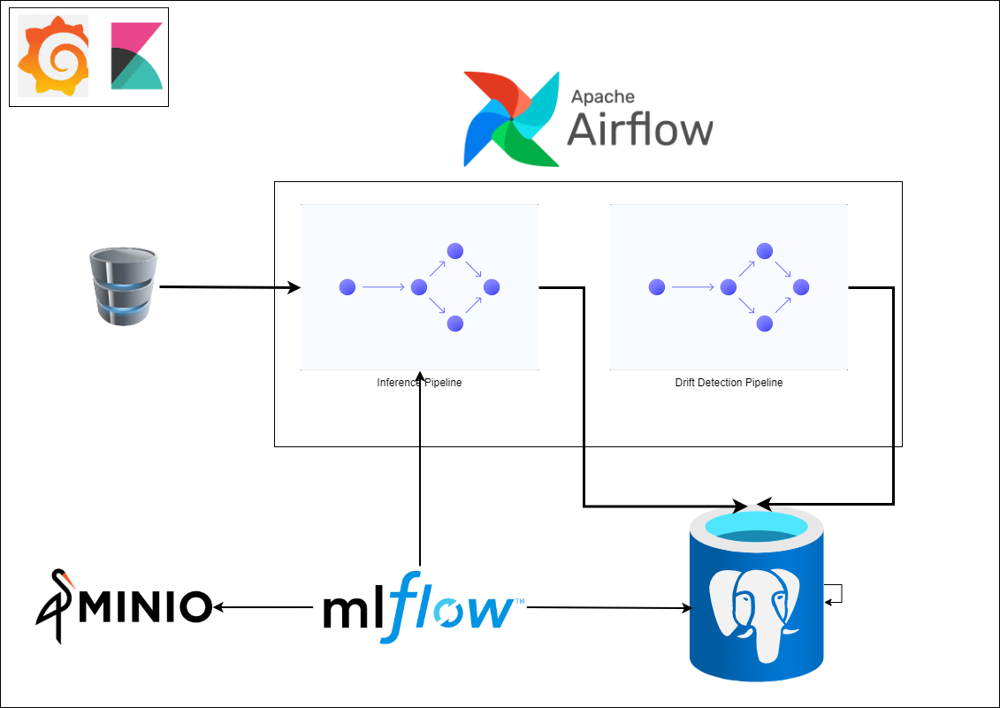
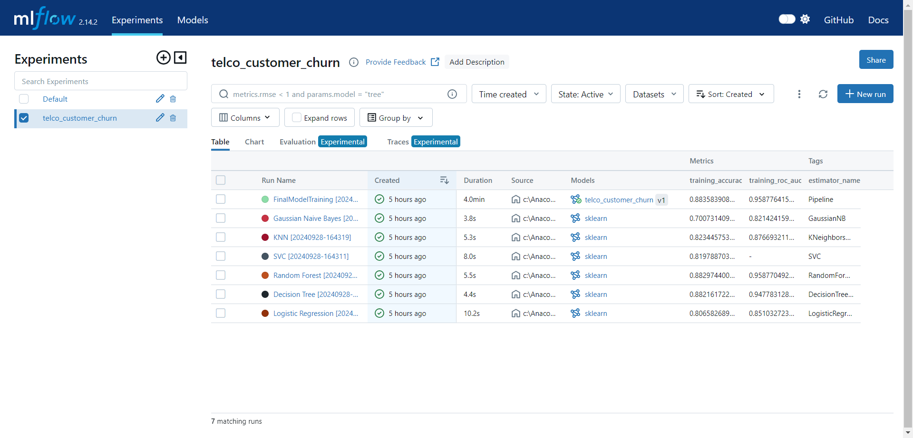
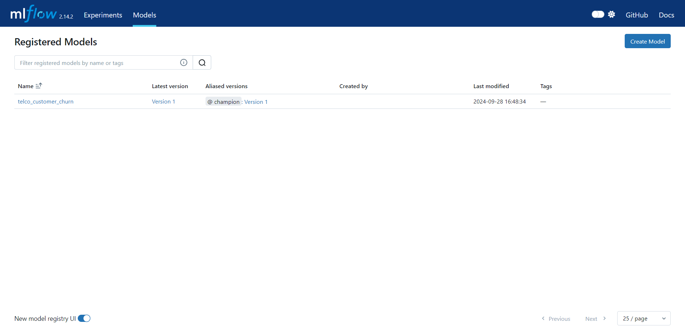
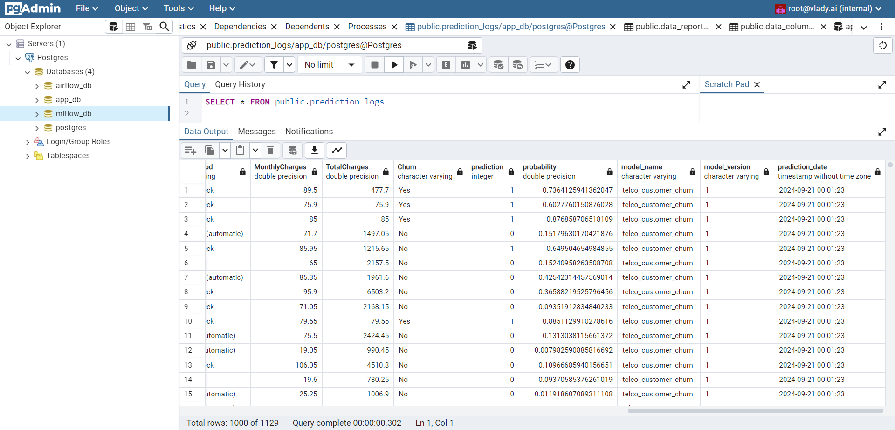
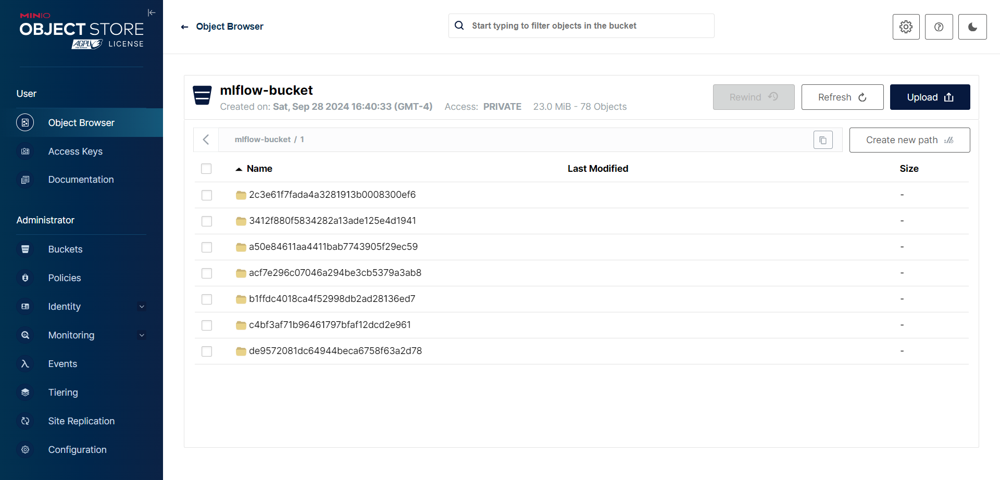
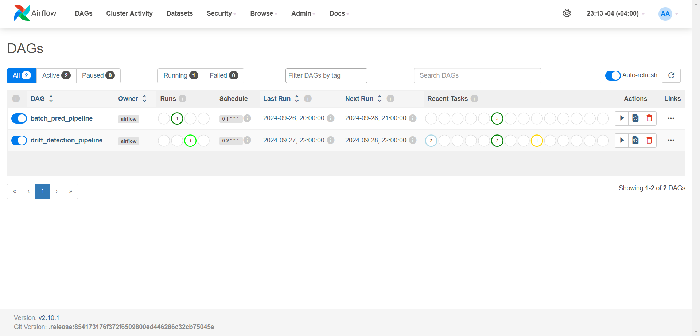
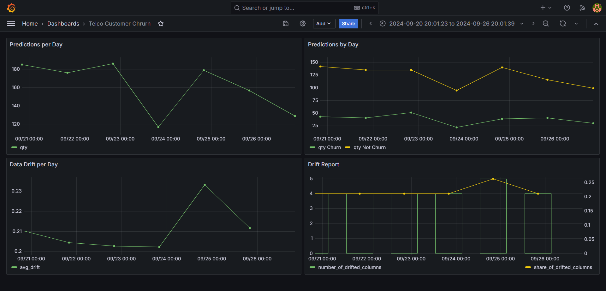
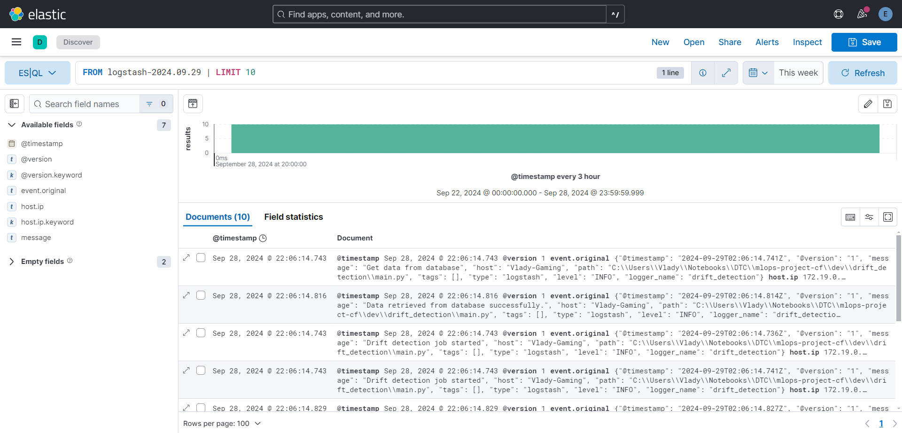

# Telcom Customer Churn Prediction - MLOps Project


## Table of Contents
1. [Overview](#overview)
2. [Dataset Information](#dataset-information)
3. [Inference](#inference)
3. [Solution Architecture](#solution-architecture)
4. [Limitations](#limitations)
5. [Local Deployment Guide](#local-deployment-guide)
6. [License](#license)

## Overview

The goal of this project is to address customer churn by building and deploying a machine learning model that predicts which customers are likely to leave the telco company. By leveraging the Telco customer churn dataset, which includes features such as customer demographics, location, services, monthly charges, and churn history, we can train a predictive model to proactively identify at-risk customers. This can help the business retain valuable customers by implementing targeted retention strategies.

To support the model's deployment and lifecycle management, the project will establish an MLOps infrastructure that focuses on the following key components:

- **ML Tracking**: Implement MLflow to record experiments, track hyperparameters, model versions, and performance metrics. This ensures reproducibility and keeps a detailed history of model iterations.

- **ML Deployment**: Use Docker as the primary deployment platform to deploy the churn prediction model into production environments, ensuring scalability and smooth delivery of predictions to business applications.

- **Workflows**: Automate workflows using Airflow to orchestrate  the prediction and monitoring processes.

- **Model Monitoring**: Continuously monitor using grafana to monitor the performance of the deployed model to detect issues like model drift, and ensure that predictions remain accurate over time.

- **Log Monitoring**: Implement centralized logging and log monitoring using ELK (Elasticsearch, Logstash, Kibana) to track logs for both the model and workflows. This ensures visibility into any issues, errors, or anomalies that may arise during pipeline execution or model performance.

This MLOps infrastructure will provide a robust foundation for operationalizing the churn prediction model and maintaining it throughout its lifecycle.

## Dataset Information

The Telco Customer Churn dataset provides detailed information about a fictional telecommunications company's customers, aiming to predict which customers are likely to leave the service. It includes features such as demographic data (gender, dependents), location, monthly charges, subscribed services (e.g., internet, TV), and churn history. This dataset helps identify patterns in customer behavior that are related to churn, making it valuable for building predictive models to guide retention strategies.
Source: [IBM Community](https://community.ibm.com/community/user/businessanalytics/blogs/steven-macko/2019/07/11/telco-customer-churn-1113).

## Inference

The Telco Customer Churn model is deployed using a pipeline in Airflow. The pipeline includes the following steps:
- Get data from database: Retrieve data from customer's database.
- Preprocess data: Clean and preprocess the data.
- Retrieve model: Retrieve the trained model from MLflow's model registry.
- Inference: Make predictions using the deployed model.
- Save data: Save the predictions to database, in order to be used for future analysis.

## Solution Architecture

The following diagram illustrates the solution architecture for the Telco Customer Churn model. 



The components of the solution are:

### Training Infrastructure

Consist of three main elements: MLflow, Postgres, and Minio. 

The MLflow component is responsible for tracking experiments, versioning models, and serving the final model.

MLflow Experiment Tracking | MLflow Model Versioning
--- | ---
 | 

The Postgres component is used to store the data. 



The Minio component is used to store the model artifacts (including the final model, reference dataset, etc).



### Workflow Infrastructure

Solution contains two pipelines: inference pipeline and monitoring pipeline. The inference pipeline is responsible for making predictions using the deployed model. The monitoring pipeline is responsible for monitoring the performance of the model. Each pipeline has a docker image containing the code for the pipeline.



### Monitoring Infrastructure

Consists in two elements: Grafana and ELK. 

The Grafana component is used to monitor the performance of the deployed model. 



The ELK component is used to monitor the logs of the model and workflows.



## Limitations

Below is a summary of the limitations of this solution:

### Model Training

Modeling process depends on data scientists. ML Engineers should coordinate with Data Scientists on how to use MLflow to track the training process in their notebooks. Then, register the final model in registry to be used in production.

### Inference and Monitoring Images Maintenance

ML Engineers should update the inference and monitoring images to the latest version when new features are added or code is modified.

## Local Deployment Guide

The following guide provides detailed instructions on how to deploy the Telco Customer Churn model locally.

1. Clone the Repository:
   ```bash
   git clone https://github.com/JorgeAbrego/churn-prediction-mlops.git
   cd churn-prediction-mlops
   ```
2. Rename `example.env` to `.env` and replace the values with your own.
   ```bash
   move .env.example .env
   nano .env
   ```
3. Create a Python virtual environment and install the dependencies in `requirements.txt`:
   ```bash
   pip install -r requirements.txt
   ```
4. Build the Docker images required for the MLOps solution:
   ```bash
   docker build -t docker-socat:latest -f .\services\socat\Dockerfile .\services\socat\
   docker build -t mlflow-server:v2.12.2 -f .\services\mlflow\Dockerfile .\services\mlflow\
   docker build -t predict_batch:latest -f services/predict_batch/Dockerfile services/predict_batch
   docker build -t drift_detection:latest -f services/drift_detection/Dockerfile services/drift_detection
   ```
5. Run the MLOps solution: 
   ```bash
   docker-compose up -d
   ```
> **_NOTE:_** Deploying the entire stack takes about 10 minutes while all checks and configurations are completed.

Once the MLOps solution is running, you can access to its different services using the following URLs:

- PGAdmin: http://localhost:8888
- MLflow: http://localhost:5000
- Airflow: http://localhost:8080
- Grafana: http://localhost:3000
- Kibana: http://localhost:5601
- Minio: http://localhost:9001


## License
This project is licensed under the MIT License - see the [LICENSE](LICENSE) file for details.